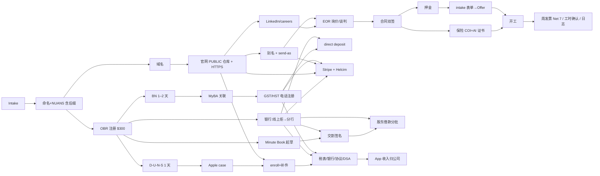

# ca-company-setup — 加拿大(安省)科技公司从零到运营

**一句话**:一家真实的一人软件公司在 24 天内走完"注册 → 税号 → 银行 → 官网邮箱 → 保险 → EOR 雇员 → 双收款通道 → Apple 组织迁移(App 收入归公司)"的每一步、每一个坑、每一份文件,提炼成可复用的阶段手册 + 模板 + Claude 代办守则。

## 怎么用

1. **先跑 intake**:读 `references/00-intake-questionnaire.md`,把 A–G 问清,答案写进 `templates/intake-answers.md`。不要跳过——后面每张表单都从这里取值。
2. **建档案仓库**:按 `references/14-record-keeping-conventions.md` 建目录,复制 `templates/00-项目总控.md`、`templates/账号与订单台账.md`、仓库 `CLAUDE.md`(14 §6);建 **PRIVATE** GitHub 远程;每次实质变更 commit + push。
3. **按阶段推进**(下表顺序 + 下方依赖图):每个阶段打开对应 reference,照"目标 → 前置 → 步骤 → ✋ → 证据 → 坑"走;Claude 代填到"用户须亲自点"处就停,截图交接。
4. **每阶段结束给用户一份「✋你要做」清单**(格式见 13 §7:已代填 / ✋你要做 / 等对方 / 已归档),同步更新总控待办表。
5. **数字与日期**:本 skill 的费用、天数、费率是 2026-08/09 安省口径,执行时以官方页面复核;找不到的写「档案记录,未二次核实」。

## 阶段总览

| # | 阶段 | 目标 | 前置依赖 | ✋ 用户本人必须做 | 产出与凭证 | 参考 |
|---|---|---|---|---|---|---|
| 0 | Intake | 问清身份/业务/结构/工具 | — | 拍板 | intake-answers、总控阶段 0 | 00 |
| 1 | 决策·命名·NUANS·地址·域名 | 名称含后缀、NUANS 报告、虚拟地址、.com | 0 | 三笔付款、地址激活 | 台账、NUANS PDF | 01 |
| 2 | OBR 注册 + Initial Return | 当天成立;Certificate/Articles;60 天内 Initial Return | 1;My Ontario Account | 登录、$300、Submit ×2、保管 Company Key | 02-注册文件/、公司信息表 | 02 |
| 3 | Minute Book | Bylaw/决议/股权/名册/ISC/IP 转让/借款决议 | 2;银行(交割) | 打印手签两晚、存 $100 | 03-公司治理/ 签署扫描 | 03 |
| 4 | CRA | MyBA 关联、GST/HST 电话注册、direct deposit、审核回电、首期申报 | BN(2);银行(5) | CRA 登录、打电话、回电、MyBA 提交 | 确认信、Expected returns 截图、ITC 清单 | 04 |
| 5 | 银行 | Chequing + 股本入账 + 三个数 | 2(Articles)、3(银行决议) | 分行面谈、存款、网银、Autodeposit | 台账关键凭据、void cheque | 05 |
| 6 | 品牌·官网·邮箱·LinkedIn | logo 包、HTTPS 官网(PUBLIC 仓库)、别名 + send-as、公司页 | 1(域名) | DNS/注册商登录、ICANN 点击、应用专用密码 | 上线记录、别名清单 | 06 |
| 7 | 保险 | CGL(+E&O)保单 + EOR 附加被保险人证书 | 8 的 SOW 条款;公司信息 | 刷卡出单、接经纪电话 | 11-保险/ 保单/COI/AI | 07 |
| 8 | 招聘 + EOR | 询价 → 谈判 → 合同 → 押金 → intake → Offer → 开工;证据包、NDA-IP、记录制度 | 5、6(partnerships@、careers 页)、7(开工前) | 面试、拍板、Adobe 签、e-Transfer、确认工时 | 07-…/合同包、招聘证据包、12-团队运营/ | 08 |
| 9 | 收款通道 | Helcim + Stripe 配置完毕、绑行、分流规则 | 4(RT)、5(void cheque)、6(官网、billing@) | 设密、身份页、绑行、Agree、SMS | 10-支付/ 准备包、台账 | 09 |
| 10 | Apple 组织迁移 | D-U-N-S → case → enroll → 补件 → ASC 税表/银行/协议/DSA 全 Active | 2、6(官网 200、域名邮箱、电话)、4(BN/RT)、5(9 位 transit) | 2FA、接电话、上传证件、certify/Submit、账号、Agree、DSA | 08-Apple迁移/ 清单、证明信、个人期报告 | 10 |
| 11 | 簿记 | 台账、季度凭证目录、公司抬头采购、订阅税务标记、资产台账、会计师包 | 4 | Billing 页改抬头/税号、公司卡 | 04-税务/凭证/、订阅台账 | 11 |
| 12 | 海外子公司(可选) | 母公司决议/章程/授权草稿、地址询价、Apostille 清单、银行预沟通 | 2、3(已交割)、5(流水)、01 §5(中文名) | 实名认证、签署、公证付款、汇款 | 11-<子公司>/ 筹办总控 | 12 |

## 依赖顺序(关键路径)

文字版硬依赖:NUANS(含 INC.)→ OBR → BN → RT;Articles + 银行决议 → 银行 → 股本入账 → Minute Book 交割;银行 + 官网 + `billing@`/`support@` → Stripe/Helcim;D-U-N-S + 官网在线(公开仓库)+ 公司电话/域名邮箱 → Apple 组织 → 迁移通过 + BN/RT + 9 位 transit → ASC Active;SOW 保险条款 → 买保险 → 开工;押金 + 客户侧 intake → Offer → 开工 → 首周发票。

## 硬规则(Claude 在本领域的行为边界)

1. **绝不代填/代输**:密码、2FA/验证码、证件上传、SIN、生日、家庭住址、银行账号/卡号、任何付款;这些页面停下截图交接。用户个人信息(姓名/地址)代填前先在对话里征得同意。
2. **绝不代点**:官方表单的 Submit / Agree / certify;商户协议、Services Agreement、Program License Agreement 由用户接受。
3. **不作声明**:不作法律/税务/移民/保险意见;起草件标注"非持牌意见,最终请专业人士过目";不替用户作商业决定,不质疑其决定,只把约束与代价写清。
4. **敏感不落文件**:密码、Company Key、网银凭据、SIN/生日/证件号不写进任何文件;电话指引写"如实口头答";ISC 登记册例外且私密。
5. **对外从公司别名发**:供应商/合同 `partnerships@`;账务与平台登录 `billing@`;支持 `support@`;政府/公开 `hello@`;Apple 通信从 Apple ID 邮箱同线程;用户要求时"发前先确认"。
6. **每次实质变更即 commit + push 到 PRIVATE 远程**;消息一行中文说清发生了什么;不攒批量。
7. **官网仓库必须 PUBLIC**(GitHub Pages 免费版);档案仓库必须 PRIVATE;两者分离。改可见性前与用户确认。
8. **只写有证据的状态**:草稿/表单打开/用户选名 ≠ 受理/核准/签署/开户/付款;对外动作记"由谁发出"。
9. **数字带口径**:费用、天数、费率写具体值 + 日期 + 来源;核不到的标"档案记录,未二次核实";不编造门户步骤。
10. **等待用后台轮询**,不 foreground sleep;可并行的阶段并行。

## references 索引(什么时候读哪个)

| 文件 | 何时读 |
|---|---|
| `references/00-intake-questionnaire.md` | 调用 skill 后第一件事;用户身份/业务/结构不清时 |
| `references/01-decision-and-naming.md` | 选管辖区、起名、买 NUANS、定虚拟地址与域名、做中文名 |
| `references/02-incorporation-obr.md` | 填 OBR Articles、拿 Certificate、Initial Return、建公司信息表、买 Profile/Status |
| `references/03-minute-book-governance.md` | 起草 Bylaw/决议/股权/名册/ISC/IP 转让/股东借款/高管任命;生成签署打印包 |
| `references/04-cra-bn-gst.md` | BN 关联、GST/HST 注册(电话)、审核回电、首期申报、ITC 与凭证规则、所得税逻辑、创始人薪酬/RRSP/PHSP |
| `references/05-banking.md` | 开户被拒、分行面谈、股本与股东借款、e-Transfer/Autodeposit、加拿大账号格式与 Apple 9 位 transit |
| `references/06-brand-web-email.md` | logo 交付包、GitHub Pages/DNS/HTTPS、别名与 send-as、LinkedIn 公司页 |
| `references/07-insurance.md` | 买 CGL/E&O、限额谈判、COI/附加被保险人、RST、保单审核 |
| `references/08-hiring-eor.md` | 直雇 vs EOR、询价谈判、合同审阅、押金与周发票、intake/Offer、NDA-IP、招聘证据包、NOC、工作记录制度、SR&ED 记录 |
| `references/09-payments.md` | Helcim/Stripe 开户与复议、逐项配置、费率到账表、中国付款人、测试付款记账、OTT Pay |
| `references/10-apple-developer-org.md` | D-U-N-S、支持工单、enroll/撤回/补件、ASC 506/W-8BEN-E/Certificate/银行/协议/DSA/Part XX、收入归属起点 |
| `references/11-bookkeeping-evidence.md` | 台账体系、凭证目录、公司抬头采购、订阅与 AI 工具税务标记、设备登记、会计师包 |
| `references/12-overseas-subsidiary.md` | 规划海外(上海)全资子公司:文件草稿、Apostille、集中登记地、银行预沟通、登记与入资顺序 |
| `references/13-claude-execution-playbook.md` | 任何代办前:浏览器自动化模式与门户特性、Gmail MCP 坑、PDF 工具链、电话话术格式、引用规范、交接清单格式 |
| `references/14-record-keeping-conventions.md` | 建仓库、写总控、commit/push、敏感纪律、仓库 CLAUDE.md 模板 |
| `references/15-decision-log.md` | 用户问"为什么这么选"或要做同类决定时 |
| `references/16-pitfalls.md` | 每阶段开工前扫一遍对应段;出现异常先查这里 |
| `references/17-timeline-benchmark.md` | 用户问"要多久、多少钱";排期与预算 |

## templates / scripts

- `templates/00-项目总控.md`、`账号与订单台账.md`、`凭证目录-README.md`、`intake-answers.md`、`daily-log-template.csv`、`release-log-template.csv`
- `templates/minute-book/`:01 Bylaw · 02 董事决议 · 03 股东决议 · 04 股票凭证 · 05 名册 · 06 ISC · 09 IP 转让 · 10 股东借款决议 · 11 高管任命 + Consent · 员工 NDA-IP 直签 · 签署打印包 HTML 骨架(README 列签署时机)
- `templates/letters/`:公司信头 · Apple 在职与签约权证明信(HTML→PDF)· Apple 支持工单邮件三段 · Apple 来电核验话术 · CRA 注册审核回电脚本 · EOR 询价邮件 + 对比表 · 银行面谈手册 · OTT Pay 咨询与跟进
- `templates/hiring/`:面试记录 · 选人决定备忘
- `scripts/html2pdf.sh <in.html> <out.pdf> [--clean]`:Chrome headless 出 Letter PDF,`--clean` 去掉说明框给对方签
- `scripts/check-sanitized.sh [dir] [-d denylist]`:复用本 skill 到别的公司/公开前,扫一遍敏感模式

占位符约定:`{{COMPANY_LEGAL_NAME}}` `{{BRAND}}` `{{DOMAIN}}` `{{REGISTERED_ADDRESS}}` `{{COMPANY_PHONE}}` `{{FOUNDER_NAME}}` `{{OCN}}` `{{BN}}` `{{DUNS}}` `{{INC_DATE}}` `{{CLOSING_DATE}}` `{{BANK_NAME}}` `{{EOR_LEGAL_NAME}}` `{{APP_NAME}}`;邮箱写作 `hello@{{DOMAIN}}` 等。

---
实操样本(私有,仅本机):`/Users/ryan/workspace/company`(ARCTURA TECHNOLOGIES INC. 2026-08-23 起的完整档案库与 159 次提交的时间线;本 skill 的全部事实来源)。
